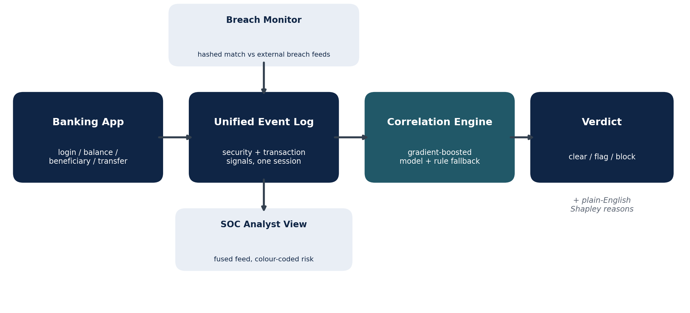

# SecureBank — Fraud Detection that Connects the Clues

> **FinSpark 26 · India Banking Cybersecurity Innovation Hackathon**
> Problem statement: *AI-Driven Correlation of Cybersecurity Telemetry & Transactional Behaviour.*


Banks watch **how you log in** (device, location, VPN, breached credentials) in one
system, and **what you do with your money** (transfers, new payees, amounts) in
another — and the two rarely talk in real time. A slightly odd login is mild on its
own. A large transfer to a brand-new payee is mild on its own. Put them in the *same
session* and you have a textbook **account takeover** that slips straight through the
gap between the two teams.

**SecureBank** closes that gap. It is a deliberately thin banking app that funnels
every action into one **unified event log**, and a trained **machine-learning model**
reads each session from that log and decides whether to clear, verify, or block —
with a plain-English reason attached to every decision.

---

## What it does

- **Correlates security and transaction signals in one session** — not two siloed systems.
- **Learns** what fraud looks like from labelled examples instead of relying only on fixed rules.
- **Explains every decision** in plain English (via exact Shapley values), so an analyst can act on it.
- **Monitors data breaches** — cross-references customers against external breach feeds and flags credential-stuffing risk.
- **Gives the security team one view** — a SOC console that shows the login and the transaction together, colour-coded by risk.

## Architecture



Every action in the banking app writes one row to a single event log. When a transfer
is attempted, the correlation engine reads the whole session from that log, builds a
feature row, and scores it. The breach monitor feeds an extra signal into the same
log; the SOC view reads back from it; and a rule-based scorer stands in automatically
if the model is ever unavailable.

## How the AI works

The verdict comes from a **gradient-boosted tree model**, not hand-written rules.
Because a prototype has no real labelled fraud history, the training data is
**bootstrapped**:

1. **Generate** thousands of synthetic sessions (`ml.py`) — some resembling ordinary
   customers, some resembling takeovers — with deliberate overlap so the task is not
   trivially separable. A fixed random seed makes every run reproducible.
2. **Train** a `GradientBoostingClassifier` on those labelled sessions and save it to
   `fraud_model.joblib`.
3. **Score & explain** each real session at run time. Explanations use **exact
   Shapley values** (subset enumeration over the nine features), turned into
   human-readable reasons such as *"logged in from an unusual location"* or
   *"amount is 84% of balance"*.

Only the learned model is persisted — never the training data itself, which is
regenerated on demand (see `export_data.py` to dump it to CSV, `inspect_model.py` to
view feature importances and a sample tree).

## Quickstart

```bash
pip install -r requirements.txt
python app.py            # serves http://127.0.0.1:5000
```

On first launch the app bootstraps itself: it creates and seeds the SQLite database,
runs an initial breach scan, and trains the fraud model (a few seconds, one time).
No external dataset or API keys are required.

> If `pip` tries to compile scikit-learn/numpy from source on a very new Python,
> force prebuilt wheels: `pip install --only-binary=:all: scikit-learn numpy joblib`.

## Live demo — two personas

All demo accounts use the password **`password123`**.

| Username | Account | Home city | Balance | Notes |
|---|---|---|---|---|
| `rahul` | 1001 | Jaipur | ₹100,000 | Main demo; trusted payee "Landlord"; found in a breach feed |
| `priya` | 1002 | Mumbai | ₹50,000 | Clean account |
| `amit` | 1003 | Delhi | ₹75,000 | Found in a breach feed |
| `landlord` | 1004 | Jaipur | ₹20,000 | Receives rahul's rent |

**The legitimate customer.** Log in as `rahul` from the *known device* and *home city*
(Jaipur), then pay the existing "Landlord" payee a small amount. The session scores
**LOW** and clears silently — and because the payee maps to a real account, the money
actually moves (log in as `landlord` and the balance has gone up).

**The account takeover.** Log in as `rahul` but choose a *new device* and an *unusual
city*, add a *brand-new payee*, and try to drain most of the balance. No single signal
is damning, but together the model scores the session **HIGH**, blocks the transfer,
and lists exactly why.

## The nine signals

The model reads one feature row per session, combining both silos:

| Security signals | Transaction signals |
|---|---|
| `new_device` | `beneficiary_age_min` (how new the payee is) |
| `unusual_location` | `amount` |
| `impossible_travel` (haversine speed check) | `amount_fraction` (share of balance) |
| `used_vpn` | |
| `credentials_breached` | |
| `failed_logins` | |

## Risk thresholds

| Score | Level | Action |
|---|---|---|
| ≥ 70 | HIGH | **blocked** |
| 40–69 | MEDIUM | **flagged** (step-up / OTP in production) |
| < 40 | LOW | **cleared** |

## Project structure

```
finspark-banking-prototype/
├── app.py               # Flask app: routes, login, transfer, SOC + breach views, self-bootstrap
├── models.py            # SQLAlchemy models: User, Beneficiary, KnownDevice, Event, BreachIntel
├── features.py          # single source of truth: the 9 features + safe baseline
├── ml.py                # synthetic data generator, model train/load, Shapley explanations
├── correlation.py       # score_transfer(): builds the feature row, calls the model, rule fallback
├── telemetry.py         # device cookie, geo stub, unified event logging
├── breach_monitor.py    # simulated breach feeds, hashed cross-referencing
├── init_db.py           # reset helper
├── export_data.py       # dump the synthetic training set to CSV
├── inspect_model.py     # print feature importances + a sample tree
├── templates/           # server-rendered pages (login, dashboard, transfer, SOC, breach scan)
├── static/style.css     # banking UI + dark SOC console
├── assets/              # architecture diagram
└── docs/                # feature & functionality summary
```

## Results & honest limitations

This is a **working prototype built for a hackathon**, and it is described as one.

- **The model is trained and evaluated only on synthetic data.** On a held-out
  synthetic split it reaches roughly **0.98 accuracy / ~0.998 ROC-AUC** — but those
  numbers measure how cleanly the *generator* separates its own two classes, **not**
  real-world fraud-catching ability. They should not be read as production metrics.
- **Some inputs are simulated.** Location, VPN status, and the breach feeds are
  stubbed at the input (a local prototype can't run live IP-geolocation or breach
  APIs). The correlation logic, impossible-travel calculation, password hashing, and
  Shapley explanations are real.
- **The model itself is a standard classifier**, competently applied — the novelty is
  the *session-level correlation of two silos* and the explainability, not the
  algorithm.
- **Prototype-grade engineering:** SQLite, Flask debug server, no automated tests yet.

**What would take it to production:** validate the same pipeline on a real public
dataset (e.g. IEEE-CIS Fraud Detection), add automated tests, wire in live
intelligence feeds, and move the event log to a streaming store (Kafka / Postgres).

## Security & privacy notes

- Passwords are **hashed** (never stored in plaintext); sensitive routes are session-gated.
- Breach matching uses **hashed identifiers** — the system never handles raw breach dumps.
- **No CVV is ever stored**, in line with card-industry (PCI-DSS) principles.
- Only the signals needed for scoring are collected, and every decision is recorded and explainable.

## Roadmap

- [ ] Validate the pipeline on a real labelled dataset (IEEE-CIS) and publish honest metrics
- [ ] Add a test suite and continuous integration
- [ ] Integrate live breach / IP-geolocation / VPN intelligence
- [ ] Move from SQLite to a streaming event store for bank-scale volumes
- [ ] Shadow-mode deployment guide and threshold-tuning tooling

## Supporting documents

- `docs/SecureBank_Features_Summary.docx` — a full walkthrough of every feature and screen.

